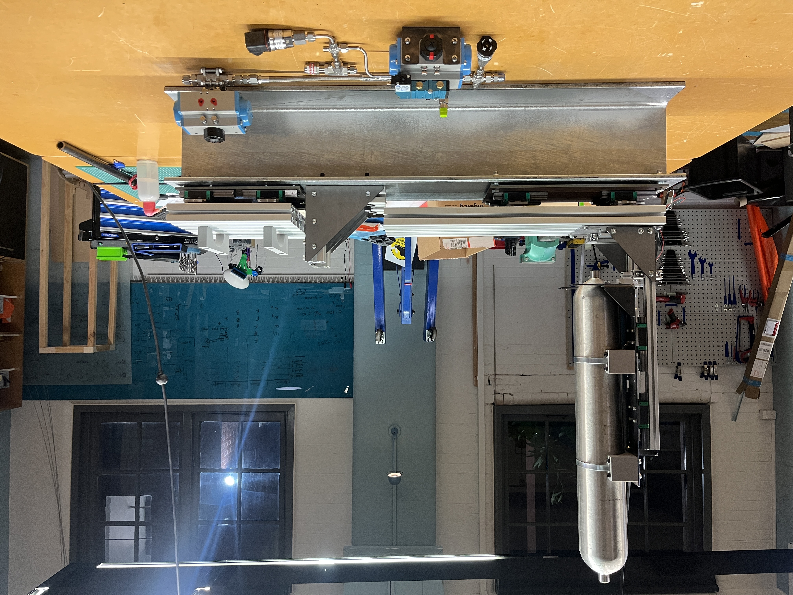
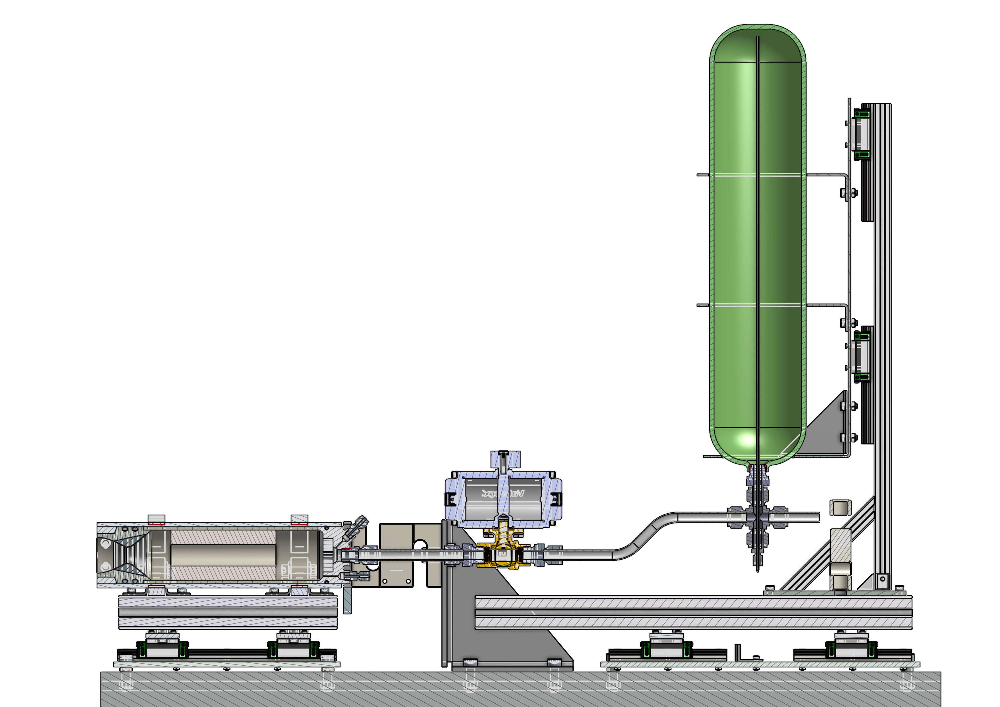

# ARES - Hybrid Rocket Engine

Currently leading the development of ARES Rocketry's first hybrid rocket engine (HRE). Before building our flight engine we are manufacturing a sub-scale engine that will produce roughly 500N of thrust for 10 seconds.

Overview of the subscale test rig designed in onshape

GSE Cart - DAQ Control cabinet + Fluids

Paraffin fuel grain, manufactured using spin casting

Section view of the sub-scale HRE

DAQ and Control block diagram

Sub-scale P&ID, can be scaled very easily for full scale

