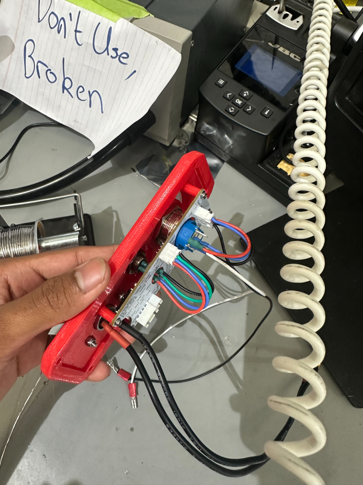
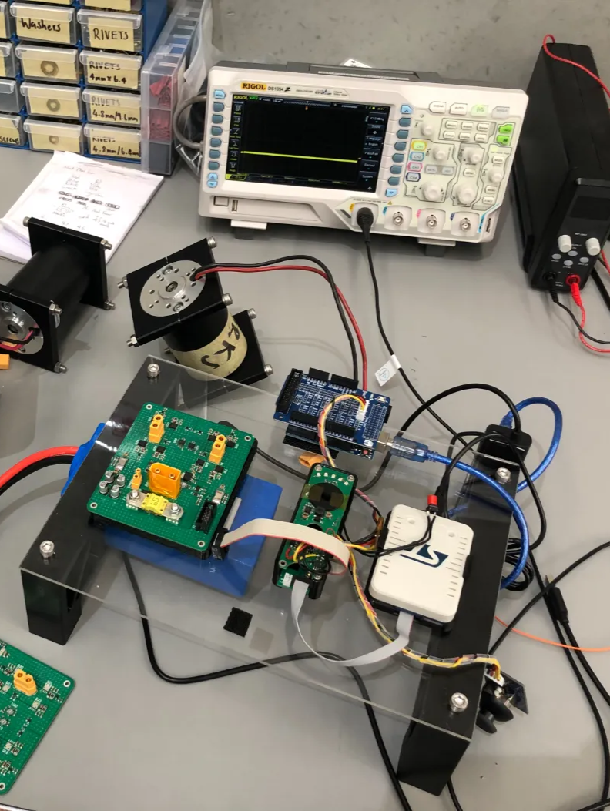
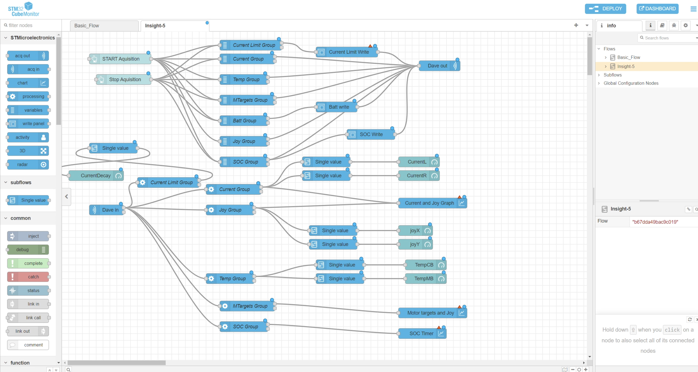

# SAFETY DAVE - Caravan Mover Electronics

Front Panel Electronics Assembly with logic board

Electronics test bed for STM32 Development

STM32 CubeMonitor Configuration for monitoring system values during testing. e.g. currents, temps etc

