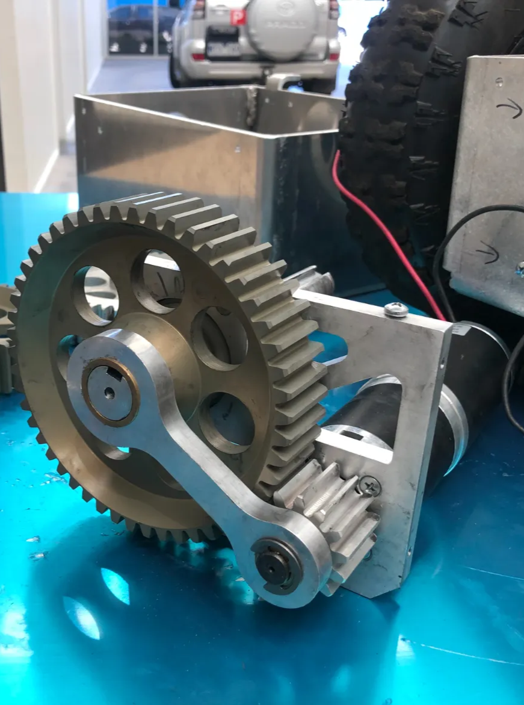
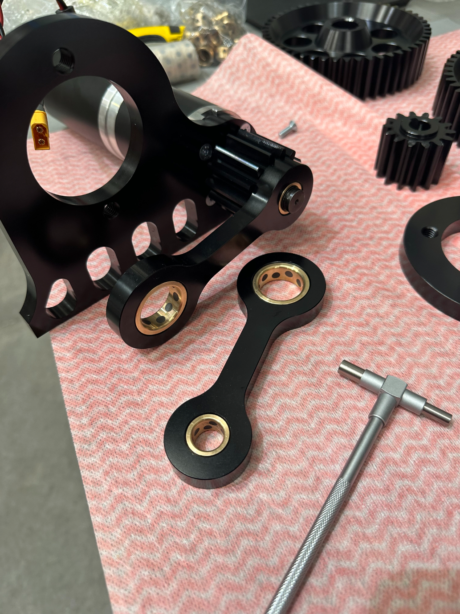
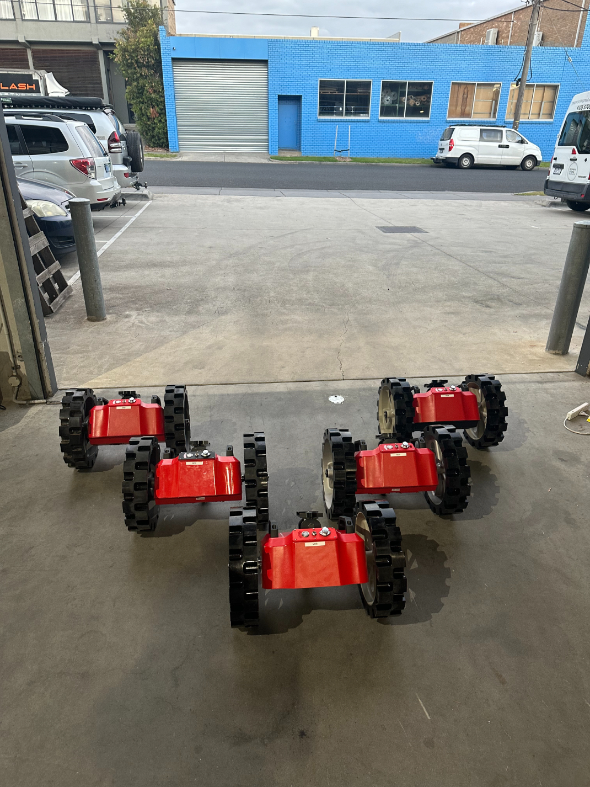
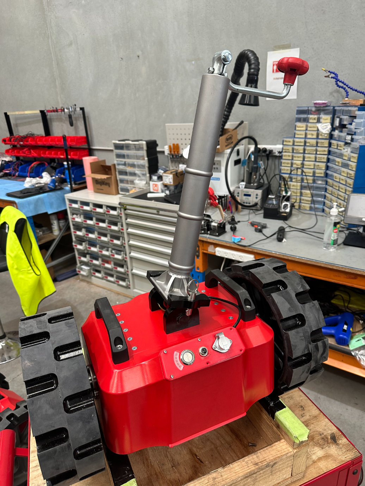

# SAFETY DAVE - Caravan Mover Mechanical Design

Dyno for caravan mover

[IMG_8113 2.mov](IMG_8113_2.mov)

Prototype motor assembly

Final motor assembly

Thermal analysis of internal temps

Pilot production run

Testing setup for thermal torture testing

Diecast chassis after post machining before paint

Assembled mover with new jockey wheel, featuring CNC machined mount

Old jockey wheel with welded mount, failed testing

CNC machined parts for final assembly

